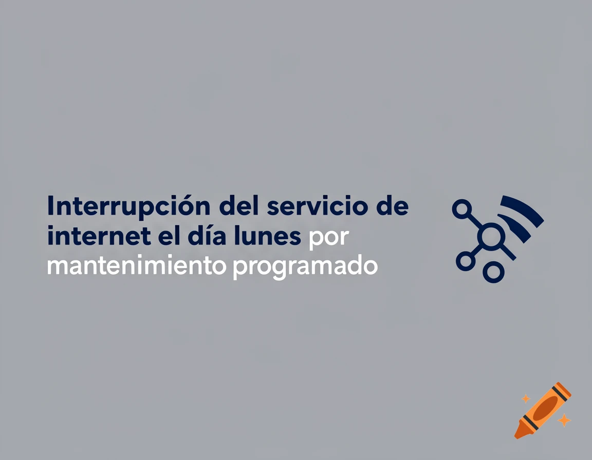

# Proyecto Final: Asistente de IA para Automatización Administrativa

## Acceso rápido
- Notebook: cuaderno.ipynb
- Imagen generada: cartel.png

## Resumen
Este proyecto desarrolla un asistente basado en Inteligencia Artificial Generativa orientado a optimizar la redacción, corrección y estandarización de documentos administrativos. Además, incorpora la generación automática de piezas visuales institucionales mediante modelos texto–imagen. La solución combina técnicas de fast prompting para mejorar la eficiencia operativa y la calidad de la comunicación.

## Introducción

### Nombre del proyecto
Asistente de IA para la Automatización y Mejora de Documentos Administrativos.

### Problema
En entornos laborales con alta carga administrativa, la redacción de documentos formales presenta errores frecuentes de estilo, claridad y formato, lo que genera retrabajos y demoras en los procesos.

### Relevancia
Esta problemática impacta directamente en:
- La eficiencia operativa
- La calidad de la comunicación institucional
- La imagen organizacional

##  Propuesta de solución

Se propone un asistente basado en IA que permita:

1. Transformar textos informales en documentos formales (modelo texto–texto)
2. Generar piezas visuales institucionales (modelo texto–imagen)

La solución se basa en el diseño estratégico de prompts que guían el comportamiento del modelo.

## Viabilidad del proyecto

El proyecto es viable debido a que:
- Utiliza herramientas accesibles (OpenAI y generadores de imágenes gratuitos)
- No requiere infraestructura compleja
- Puede implementarse de manera progresiva

## Objetivos

### Objetivo general
Automatizar la gestión documental administrativa mediante el uso de IA.

### Objetivos específicos
- Reducir el tiempo de redacción de documentos formales
- Estandarizar el tono y estilo institucional
- Minimizar errores gramaticales y de formato
- Generar contenido visual de apoyo a la comunicación

## Metodología

Se aplica un enfoque de **Ingeniería de Prompts Iterativa**, que incluye:

1. Identificación del problema
2. Diseño de prompts
3. Prueba y ajuste
4. Evaluación de resultados

## Herramientas y Tecnologías

### Técnicas de Fast Prompting utilizadas:

- **Role Prompting**: asignación de rol experto
- **Few-Shot Prompting**: uso de ejemplos
- **Delimitadores**: separación clara de instrucciones
- **Instruction-based prompting**: reglas explícitas

## Implementación

### Prompt texto–texto

## Resultado visual

## Resultados

La implementación permite:

- Reducir significativamente el tiempo de redacción
- Generar documentos formales de manera automática
- Mejorar la calidad comunicacional
- Incorporar soporte visual a la comunicación institucional

### Comparación:

| Antes | Después |
|------|--------|
| Texto informal | Documento formal estructurado |
| Sin soporte visual | Cartel institucional generado |

## Conclusiones

El proyecto demuestra que la Inteligencia Artificial, aplicada mediante una correcta ingeniería de prompts, permite optimizar procesos administrativos de forma eficiente. La integración de modelos texto–texto y texto–imagen amplía el alcance de la solución, logrando mejoras tanto en la calidad del contenido como en su presentación.

## Referencias

- OpenAI Documentation  
- NightCafe Studio  
- Material de la diplomatura  
